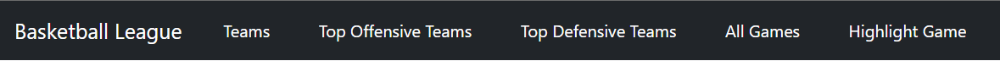
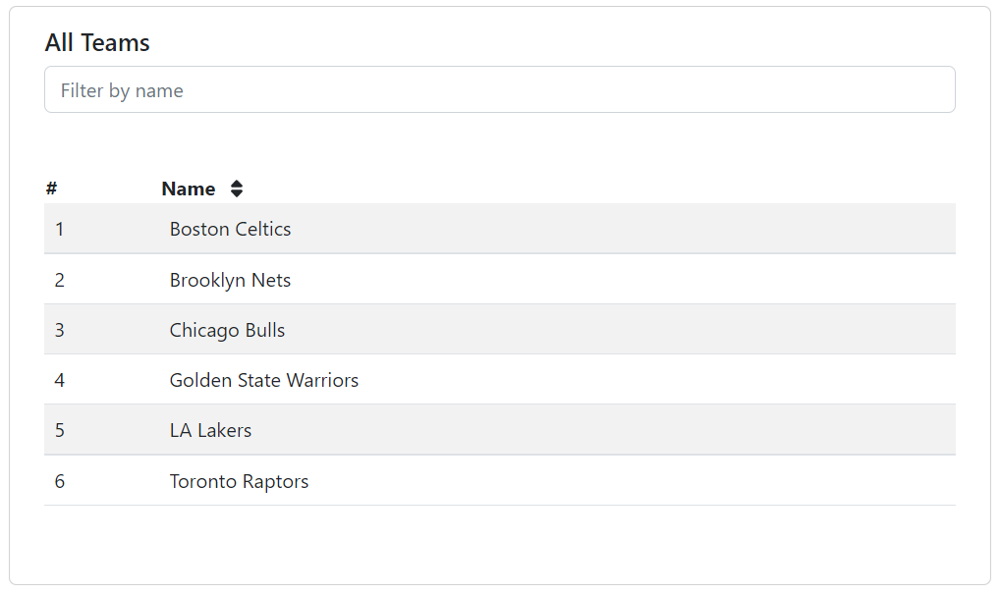
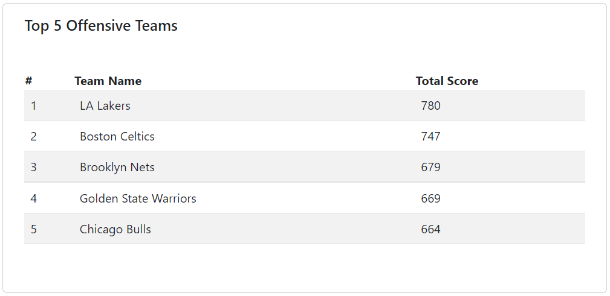
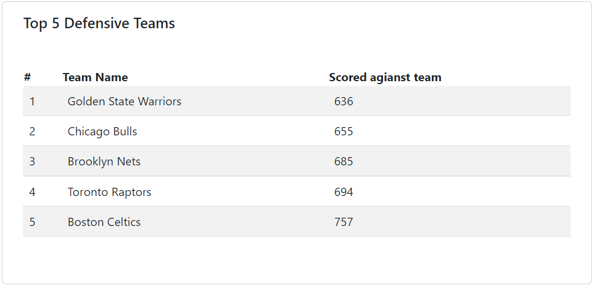
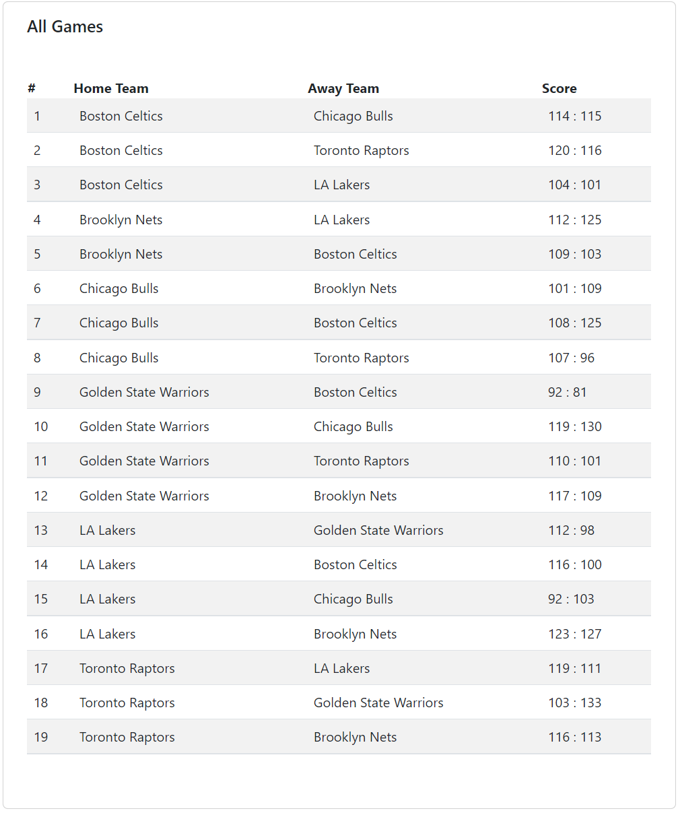
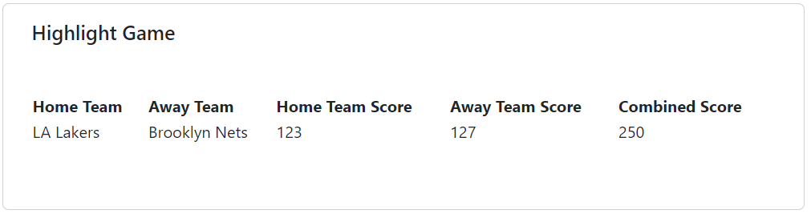

# Basketball League
This app presents information about a basketball league teams and games.

# Implementation Versions*
The version on the 🔷 [**main branch**](https://github.com/MartinVladkov/BasketballLeague/tree/main) implements the business logic in stored procedures.
Alternative solution on the 🔷 [**service branch**](https://github.com/MartinVladkov/BasketballLeague/tree/service-logic) where the main data processing logic is in the backend service layer.

# Technologies
- ASP .NET Core API
- Angular
- Entity Framework Core
- MS SQL 

## Features 
- Sortable and searchable list of all teams in the league
- List of all played games
- Top 5 offensive teams
- Top 5 defensive teams
- Highlight match with most scored points combined

## Screenshots

 
